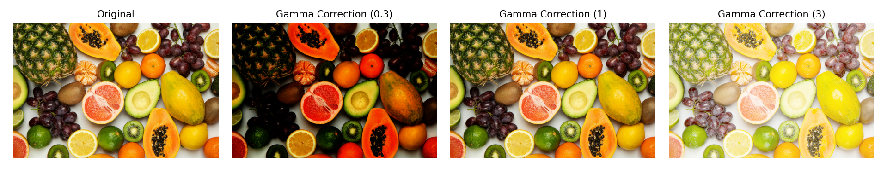

# 🎛️ Gamma Correction

This project is a simple Python application that applies different levels of gamma correction to an image and visualizes the results. Gamma correction is an essential image processing technique used to adjust the brightness perception of images.

## 🖼️ Sample Output

Below is an image of fruits processed with different gamma values:



> From left to right: Original, Gamma 0.3 (darkening), Gamma 1 (no change), Gamma 3 (brightening)

---

## 🔧 Installation and Usage

### 1. Clone the Repository

```bash
git clone https://github.com/omerturantr/gamma-correction.git
cd gamma-correction
```

### 2. Install Requirements

```bash
pip install opencv-python matplotlib numpy
```

### 3. Run the Application

```bash
python main.py
```

---

## 🧠 Code Explanation

The `apply_gamma_correction()` function creates a Look-Up Table (LUT) based on the given gamma value and applies it to the image:

```python
def apply_gamma_correction(image, gamma):
    invGamma = 1.0 / gamma
    table = np.array([(i / 255.0) ** invGamma * 255 for i in np.arange(256)]).astype("uint8")
    return cv2.LUT(image, table)
 ```

- **Gamma < 1**: Darkens the image  
- **Gamma = 1**: No change  
- **Gamma > 1**: Brightens the image

---

## 📁 Project Structure

```
gamma-correction/
├── fruits.jpg                        # Input image
├── Screenshot 2025-05-20 195156.png # Output screenshot
├── main.py                          # Main Python script
└── README.md
```

---

## 📄 License

This project is licensed under the MIT License.

---

## 👤 Developer

**Ömer Turan**  
📧 [omerturantr@gmail.com](mailto:omerturantr@gmail.com)  
🔗 [GitHub Profile](https://github.com/omerturantr)
